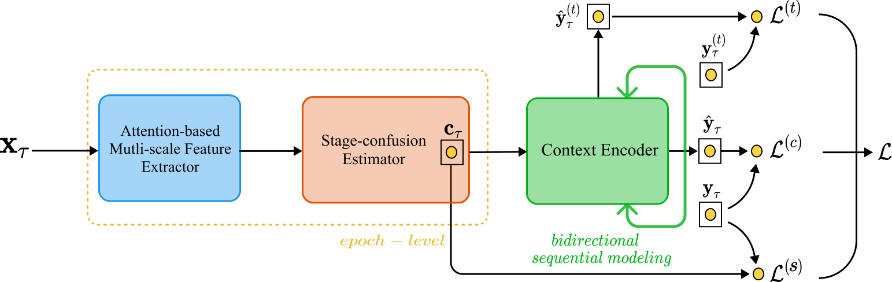

## TransSleep: Transitioning-aware Attention-based Deep Neural Network for Automatic Sleep Staging

This repository provides a PyTorch implementation of a submitted paper: hi
> **TransSleep: Transitioning-aware Attention-based Deep Neural Network for Automatic Sleep Staging** 
>  Jaeun Phyo1, [Wonjun Ko](https://scholar.google.com/citations?user=Fvzg1_sAAAAJ&hl=ko&oi=ao)1, [Eunjin Jeon](https://scholar.google.com/citations?user=U_hg5B0AAAAJ&hl=ko)1, [Heung-Il Suk](https://scholar.google.co.kr/citations?user=dl_oZLwAAAAJ&hl=ko)1, 2 
> (1Department of Brain and Cognitive Engineering, Korea University)  
> (2Department of Artificial Intelligence, Korea University)  
> 
> **Abstract:** *Sleep staging is essential for sleep assessment and plays a vital role as one of the health indicators. Due to its capability, recent studies exploited and devised various machine learning as well as deep learning architectures for sleep staging. However, two important challenges hinder their practical use. Specifically, to effectively capture salient waveforms in sleep signal and to correctly classify confusing stages in transitioning epochs are rarely easy. In this work, we propose a novel deep neural network structure that that can capture local temporal patterns and exploits two auxiliary tasks to distinguish confusing stages. Particularly, our proposed framework adopts an attention-based multi-scale feature extractor for identifying the salient waveforms. A stage-confusion estimator with a novel auxiliary task, epoch-level stage classification, estimates confidence scores for confusing stages. A context encoder with another novel stage-transition detection auxiliary task represents contextual relationships across neighboring epochs. With the estimated information by two auxiliary tasks as well as architectural strength, our proposed method shows promising results for the automatic sleep staging. We demonstrated the validity of our proposed method on two publicly available datasets Sleep-EDF and MASS by achieving state-of-the-art performances. Moreover, we analyzed the results from diverse perspective with ablative cases. Based on our results, we believe that the proposed network has immense potential to provide new insights in deep learning-based sleep staging.*

## Dependencies
* [Python 3.7+](https://www.continuum.io/downloads)
* [PyTorch 1.0.0+](https://pytorch.org/)

## Downloading datasets
To download Sleep-EDF dataset
* https://physionet.org/content/sleep-edf/1.0.0/

To download MASS dataset
* http://ceams-carsm.ca/mass/

## Usage
`model.py` contains the proposed deep learning architectures, `utils.py` contains functions used for experimental procedures, and `main.py` contains the main experimental functions.

## Acknowledgements
This work was supported by Institute for Information & Communications Technology Promotion (IITP) grant funded by the Korea government under Grant 2017-0-00451 (Development of BCI based Brain and Cognitive Computing Technology for Recognizing User’s Intentions using Deep Learning) and Grant 2019-0-00079 (Department of Artificial Intelligence, Korea University).
